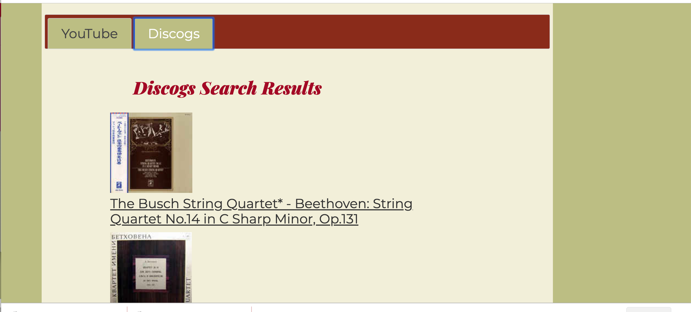

# PerformanceSearch
API Hack Capstone for bloc.io module 11

[Link to live app](https://eusebius24.github.io/PerformanceSearch/)
## Purpose
This app is targeted towards musicians who want to hear a performance of a piece they're working on.  It searches YouTube for performance videos and, simultaneously, Discogs for physical recordings (vinyl, CD, cassette).
## Screenshots
Main screen:

YouTube search results:

Discogs search results:

## Technologies used
HTML5, CSS3, JavaScript(ES6), JQuery, JQuery UI

## Future plans
More searches will be integrated including International Music Score Library Project and Sheetmusicplus.com for sheet music scores.
